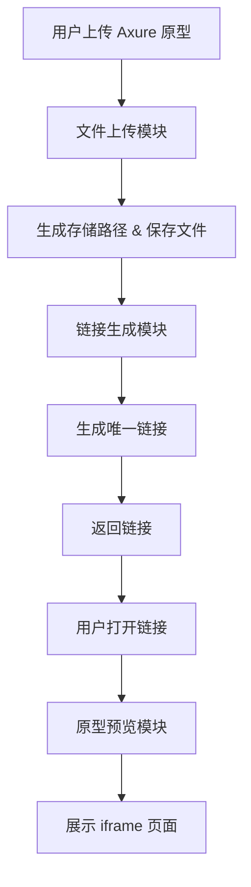

# 模块设计文档（modules_design.md）

## 1. 顶层功能模块

- 文件上传模块：接收用户上传的 Axure HTML 原型目录
- 链接生成模块：生成唯一的可访问链接
- 原型预览模块：通过 iframe 实现在线预览
- 原型管理模块：展示上传记录，支持查看、删除原型

## 2. 模块详情

### 文件上传模块

| 字段 | 说明 |
|------|------|
| 输入 | 用户上传的 Axure HTML 文件夹 |
| 输出 | 存储在服务器的原型文件路径、文件元数据 |
| 对外接口 | POST /api/upload |

### 链接生成模块

| 字段 | 说明 |
|------|------|
| 输入 | 原型文件的存储路径 |
| 输出 | 唯一访问链接（如 https://p.domain.com/abc123） |
| 对外接口 | 内部调用，无需暴露 API |

### 原型预览模块

| 字段 | 说明 |
|------|------|
| 输入 | 链接中携带的访问 token / key |
| 输出 | iframe 加载的 HTML 页面 |
| 对外接口 | GET /p/{short_id} |

### 原型管理模块

| 字段 | 说明 |
|------|------|
| 输入 | 用户的上传记录请求 |
| 输出 | 原型列表、操作接口（查看、删除链接） |
| 对外接口 | GET /api/prototypes DELETE /api/prototype/{id} |

## 3. 系统边界示意

| 外部系统 | 交互方向 | 目的 |
|----------|----------|------|
| 浏览器   | 双向     | 用户上传文件、获取链接、预览原型 |
| 文件存储服务（如本地存储或对象存储） | 单向（写入） | 保存上传的原型文件 |

## 4. 高层数据流 / 用户流程图

## 5. 模块依赖与优先级

| 依赖模块 | 构建顺序 | 开发优先级 |
|-----------|------------|-------------|
| 文件上传模块 | 第1步 | High |
| 链接生成模块 | 第2步 | High |
| 原型预览模块 | 第3步 | High |
| 原型管理模块 | 第4步 | Mid |

## 6. 非目标 (Out-of-Scope)

- 用户权限系统
- 项目 / 原型版本管理
- SSO 登录与权限绑定
- 统计功能与数据分析
